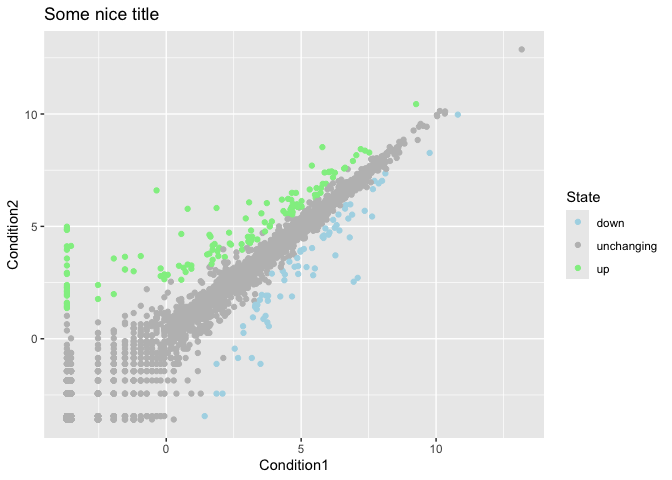
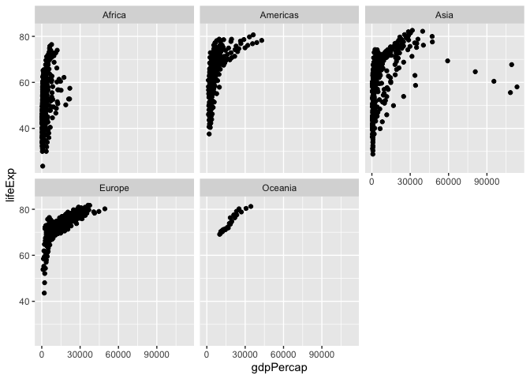

# Class 5: Data Visualization with ggplot
Lynette (PID: A16648332)

Today we will have our first play with the **ggplot2** package - one of
the most popular graphics packages on the planet.

There are many plotting systems in R. These include so-called *“base”*
plotting/graphics.

``` r
plot(cars)
```


Base plot is generally rather short code and somewhat dull plots - but
it is always there for you and is fast for big datasets.

If I want to use **ggplot2** it takes some more work

``` r
#ggplot(cars)
```

I need to install the package first to my computer. To do this, I can
use the function `install.packages("ggplot2")`

Every time I want to use a package, I need to load it up with a
`library()` call.

``` r
library(ggplot2)
```

Now finally I can use ggplot

``` r
ggplot(cars)
```


Every ggplot has at least 3 things:

- **data** (the data.frame with the data you want to plot)
- **aes** (the aesthetic mapping of the data to the plot)
- **geom** (how do you want the plot to look: points, lines, columns,
  etc.)

``` r
head(cars) 
```

      speed dist
    1     4    2
    2     4   10
    3     7    4
    4     7   22
    5     8   16
    6     9   10

``` r
ggplot(cars) +
  aes(x=speed, y=dist) +
  geom_point() 
```


``` r
ggplot(cars) +
  aes(x=speed, y=dist) +
  geom_point() +
  geom_smooth() 
```

    `geom_smooth()` using method = 'loess' and formula = 'y ~ x'


I want a linear model and no standard error bounds on my plot. I also
want nicer axis labels, a title, etc.

``` r
bp<-ggplot(cars) +
  aes(x=speed, y=dist) +
  geom_point()  
```

``` r
bp + geom_smooth(se=FALSE, method = "lm") + 
  labs(title= "Stopping Distance of Old Cars", 
       x="Speed (MPH)",
       y="Distance (ft)",
       caption= "From the cars dataset") +
  theme_bw()
```

    `geom_smooth()` using formula = 'y ~ x'


## A more compicated scatter plot

Here we make a plot of gene expression data:

``` r
url <- "https://bioboot.github.io/bimm143_S20/class-material/up_down_expression.txt"
genes<- read.delim(url)
```

``` r
head(genes)
```

            Gene Condition1 Condition2      State
    1      A4GNT -3.6808610 -3.4401355 unchanging
    2       AAAS  4.5479580  4.3864126 unchanging
    3      AASDH  3.7190695  3.4787276 unchanging
    4       AATF  5.0784720  5.0151916 unchanging
    5       AATK  0.4711421  0.5598642 unchanging
    6 AB015752.4 -3.6808610 -3.5921390 unchanging

``` r
nrow(genes)
```

    [1] 5196

``` r
ncol(genes)
```

    [1] 4

``` r
colnames(genes)
```

    [1] "Gene"       "Condition1" "Condition2" "State"     

``` r
table(genes$State)
```


          down unchanging         up 
            72       4997        127 

``` r
sum(genes$State == "up")
```

    [1] 127

``` r
round(sum(genes$State == "up") / nrow(genes) *100,4)
```

    [1] 2.4442

``` r
n.gene <- nrow(genes)
n.up <- sum(genes$State == "up")

up.percent <- n.up/n.gene *100
round(up.percent, 2)
```

    [1] 2.44

``` r
head(genes, 2)
```

       Gene Condition1 Condition2      State
    1 A4GNT  -3.680861  -3.440135 unchanging
    2  AAAS   4.547958   4.386413 unchanging

``` r
p <- ggplot(genes) +
  aes(x=Condition1, y=Condition2, col=State) +
  geom_point()
```

Add title and change the colors

``` r
p + labs (title= "Some nice title") +
  scale_colour_manual( values=c("lightblue","gray","lightgreen") )
```



## Exploring the gapminder dataset

Here we will load up the gapminder dataset to get practice with
different aes mappings

``` r
url <- "https://raw.githubusercontent.com/jennybc/gapminder/master/inst/extdata/gapminder.tsv"

gapminder <- read.delim(url)
```

> Q. How many entry rows are in this dataset?

``` r
nrow(gapminder)
```

    [1] 1704

> Q. How many columns are in this dataset?

``` r
ncol(gapminder)
```

    [1] 6

``` r
dim(gapminder)
```

    [1] 1704    6

``` r
head(gapminder)
```

          country continent year lifeExp      pop gdpPercap
    1 Afghanistan      Asia 1952  28.801  8425333  779.4453
    2 Afghanistan      Asia 1957  30.332  9240934  820.8530
    3 Afghanistan      Asia 1962  31.997 10267083  853.1007
    4 Afghanistan      Asia 1967  34.020 11537966  836.1971
    5 Afghanistan      Asia 1972  36.088 13079460  739.9811
    6 Afghanistan      Asia 1977  38.438 14880372  786.1134

``` r
table(gapminder$year)
```


    1952 1957 1962 1967 1972 1977 1982 1987 1992 1997 2002 2007 
     142  142  142  142  142  142  142  142  142  142  142  142 

> How many continents?

``` r
table(gapminder$continent)
```


      Africa Americas     Asia   Europe  Oceania 
         624      300      396      360       24 

I could use the `unique` function…

``` r
unique(gapminder$continent)
```

    [1] "Asia"     "Europe"   "Africa"   "Americas" "Oceania" 

``` r
length(unique(gapminder$continent))
```

    [1] 5

> Q. How many countries?

``` r
unique(gapminder$country)
```

      [1] "Afghanistan"              "Albania"                 
      [3] "Algeria"                  "Angola"                  
      [5] "Argentina"                "Australia"               
      [7] "Austria"                  "Bahrain"                 
      [9] "Bangladesh"               "Belgium"                 
     [11] "Benin"                    "Bolivia"                 
     [13] "Bosnia and Herzegovina"   "Botswana"                
     [15] "Brazil"                   "Bulgaria"                
     [17] "Burkina Faso"             "Burundi"                 
     [19] "Cambodia"                 "Cameroon"                
     [21] "Canada"                   "Central African Republic"
     [23] "Chad"                     "Chile"                   
     [25] "China"                    "Colombia"                
     [27] "Comoros"                  "Congo, Dem. Rep."        
     [29] "Congo, Rep."              "Costa Rica"              
     [31] "Cote d'Ivoire"            "Croatia"                 
     [33] "Cuba"                     "Czech Republic"          
     [35] "Denmark"                  "Djibouti"                
     [37] "Dominican Republic"       "Ecuador"                 
     [39] "Egypt"                    "El Salvador"             
     [41] "Equatorial Guinea"        "Eritrea"                 
     [43] "Ethiopia"                 "Finland"                 
     [45] "France"                   "Gabon"                   
     [47] "Gambia"                   "Germany"                 
     [49] "Ghana"                    "Greece"                  
     [51] "Guatemala"                "Guinea"                  
     [53] "Guinea-Bissau"            "Haiti"                   
     [55] "Honduras"                 "Hong Kong, China"        
     [57] "Hungary"                  "Iceland"                 
     [59] "India"                    "Indonesia"               
     [61] "Iran"                     "Iraq"                    
     [63] "Ireland"                  "Israel"                  
     [65] "Italy"                    "Jamaica"                 
     [67] "Japan"                    "Jordan"                  
     [69] "Kenya"                    "Korea, Dem. Rep."        
     [71] "Korea, Rep."              "Kuwait"                  
     [73] "Lebanon"                  "Lesotho"                 
     [75] "Liberia"                  "Libya"                   
     [77] "Madagascar"               "Malawi"                  
     [79] "Malaysia"                 "Mali"                    
     [81] "Mauritania"               "Mauritius"               
     [83] "Mexico"                   "Mongolia"                
     [85] "Montenegro"               "Morocco"                 
     [87] "Mozambique"               "Myanmar"                 
     [89] "Namibia"                  "Nepal"                   
     [91] "Netherlands"              "New Zealand"             
     [93] "Nicaragua"                "Niger"                   
     [95] "Nigeria"                  "Norway"                  
     [97] "Oman"                     "Pakistan"                
     [99] "Panama"                   "Paraguay"                
    [101] "Peru"                     "Philippines"             
    [103] "Poland"                   "Portugal"                
    [105] "Puerto Rico"              "Reunion"                 
    [107] "Romania"                  "Rwanda"                  
    [109] "Sao Tome and Principe"    "Saudi Arabia"            
    [111] "Senegal"                  "Serbia"                  
    [113] "Sierra Leone"             "Singapore"               
    [115] "Slovak Republic"          "Slovenia"                
    [117] "Somalia"                  "South Africa"            
    [119] "Spain"                    "Sri Lanka"               
    [121] "Sudan"                    "Swaziland"               
    [123] "Sweden"                   "Switzerland"             
    [125] "Syria"                    "Taiwan"                  
    [127] "Tanzania"                 "Thailand"                
    [129] "Togo"                     "Trinidad and Tobago"     
    [131] "Tunisia"                  "Turkey"                  
    [133] "Uganda"                   "United Kingdom"          
    [135] "United States"            "Uruguay"                 
    [137] "Venezuela"                "Vietnam"                 
    [139] "West Bank and Gaza"       "Yemen, Rep."             
    [141] "Zambia"                   "Zimbabwe"                

``` r
length(unique(gapminder$country))
```

    [1] 142

``` r
ggplot(gapminder) +
  aes(x=gdpPercap, y=lifeExp) +
  geom_point(alpha=0.2)
```


``` r
library(dplyr)
```


    Attaching package: 'dplyr'

    The following objects are masked from 'package:stats':

        filter, lag

    The following objects are masked from 'package:base':

        intersect, setdiff, setequal, union

``` r
gapminder_2007 <- gapminder %>% filter(year==2007)
```

``` r
ggplot(gapminder_2007) +
  aes(x=gdpPercap, y=lifeExp, col=continent, size=pop) +
  geom_point(alpha=0.5)
```


``` r
ggplot(gapminder) +
  aes(x=gdpPercap, y=lifeExp) +
  geom_point() +
facet_wrap(~continent)
```


